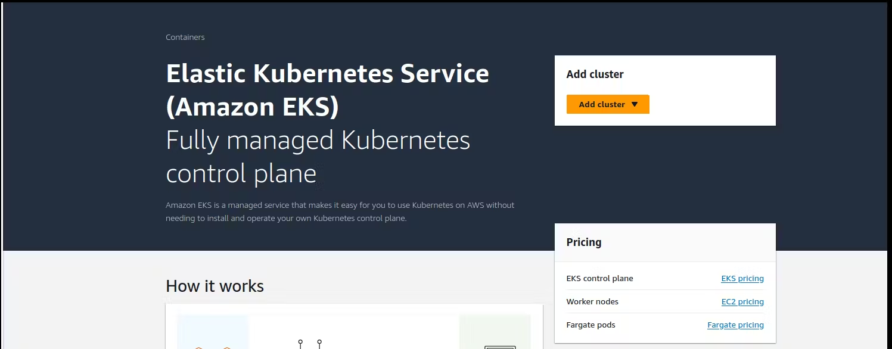
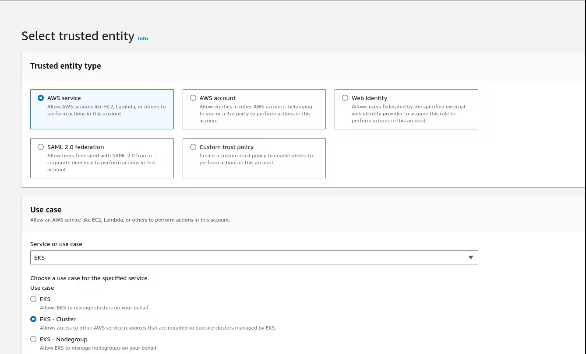
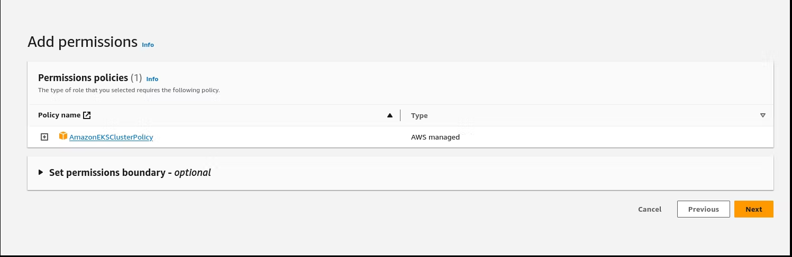
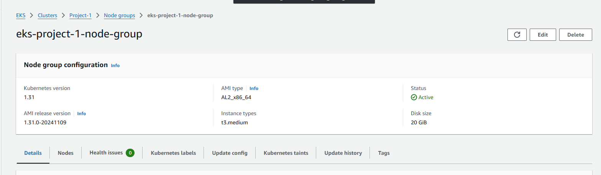

# Kubernetes End to End Project on EKS(Amazon Kubernetes Service)

- Prerequisites:

Terraform for infrastructure provisioning.

kubectl – A command line tool for working with Kubernetes clusters. For more information, see Installing or updating kubectl.

eksctl – A command line tool for working with EKS clusters that automates many individual tasks.

AWS CLI – A command line tool for working with AWS services, including Amazon EKS. For more information, see Installing, updating, and uninstalling the AWS CLI in the AWS Command Line Interface User Guide. After installing the AWS CLI, we recommend that you also configure it. For more information, see Quick configuration with aws configure in the AWS Command Line Interface User Guide.

#  Project Title: Deploying 2048 Game App on Amazon EKS

- Project Description:

A Kubernetes End-to-End (E2E) project for deploying a 2048 game app on Amazon Elastic Kubernetes Service (EKS) involves setting up, deploying, and managing the popular 2048 game application on a Kubernetes cluster running on AWS EKS. This project aims to demonstrate how to containerize a web application, deploy it on EKS, manage the cluster, and expose the application to users.

- Containerization:

I began by containerizing the 2048 game using Docker. This involved creating a Dockerfile to define the application's runtime environment and dependencies, ultimately resulting in a Docker image ready for deployment.

- Deployment:

The containerized 2048 game was deployed on the EKS cluster using Kubernetes. I defined Kubernetes deployment and service YAML files to ensure the application's efficient management and availability.

- Scaling and Management:

I explored Kubernetes's scaling capabilities, adjusting the number of application replicas based on demand. This ensured the game could handle varying levels of user traffic seamlessly

- Application Exposure:

To make the 2048 game accessible to users, I created a Kubernetes service to expose it securely over the internet. Additionally, I could have implemented an Ingress controller for more advanced routing

- Step 1: Create an EKS cluster

We are going to provision the infrastracture manually and automate the infrastructure creation using Terraform.

- Step 2: Create an IAM role eks-cluster-role with 1 policy attached: AmazonEKSClusterPolicy

Create another IAM role 'eks-node-grp-role' with 3 policies attached: 
(Allows EC2 instances to call AWS services on your behalf.)
    - AmazonEKSWorkerNodePolicy
    - AmazonEC2ContainerRegistryReadOnly
    - AmazonEKS_CNI_Policy

Choose default VPC, Choose 2 or 3 subnets
Choose a security group which open the ports 22, 80, 8080
cluster endpoint access: public

For VPC CNI, CoreDNS and kube-proxy, choose the default versions, For CNI, latest and default are 
different. But go with default.

Click 'Create'. This process will take 10-12 minutes. Wait till your cluster shows up as Active.

- Step 3: Add Node Groups to our cluster
 
